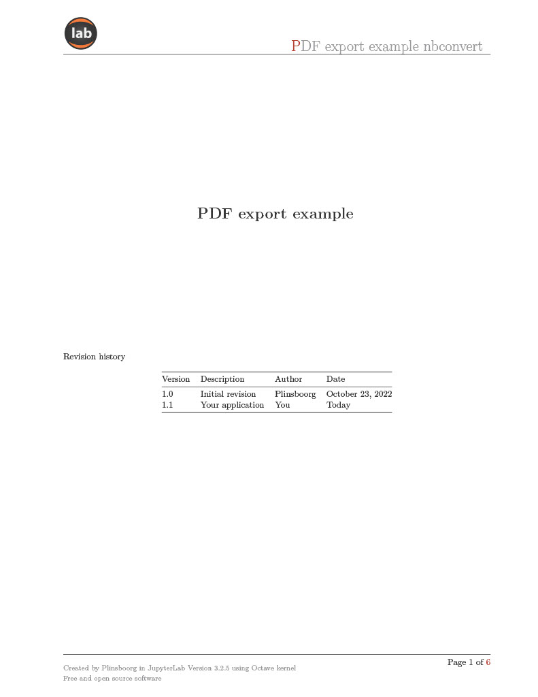
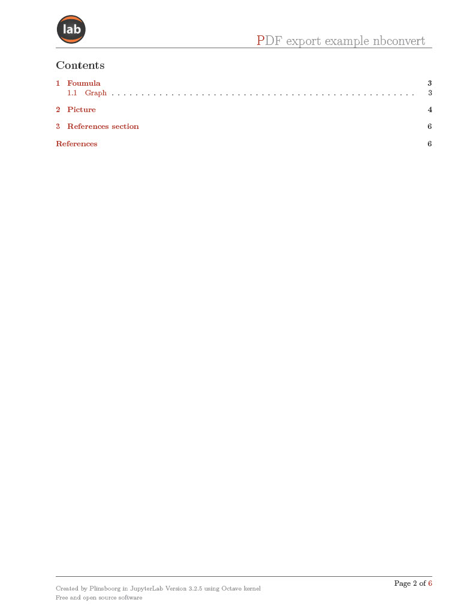
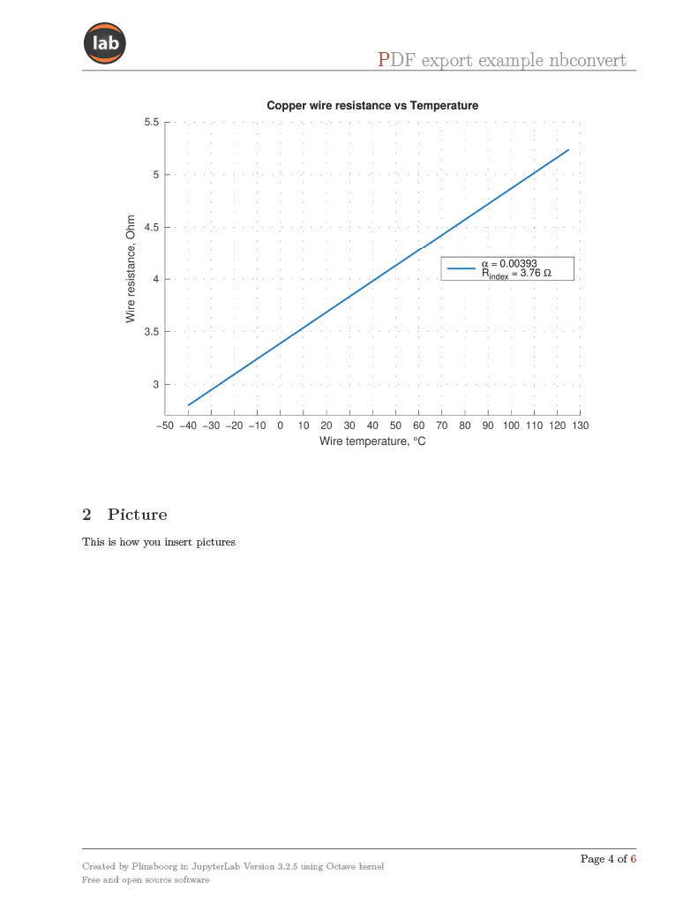

# Nbconvert_7_export_to_PDF_template

## How to use the template

Copy export_template_pdf folder to your jupyter notebook project folder. 
edit index.tex.j2. Insert the document name, header and footer data. Adjust \graphicspath with the path to the project.
Copy the last cell from the pdf_export_example.ipynb to your project. Use it for pdf generation.

## License
You can reuse the template without any restriction. 
Template is provided as is. No warrany.

## Previews 

## Keywords
nbconvert, nb, convert, jupyter, lab, notebook, pdf, export, example, template.
